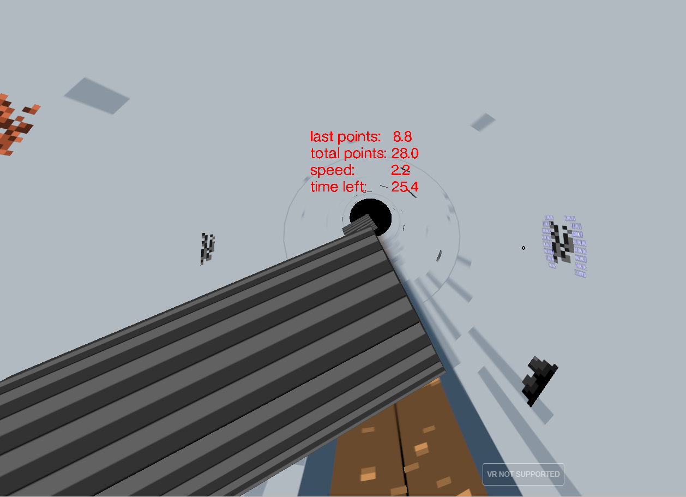

# Introduction
The **VR Pipe Inspector** is the VR version of the Pipe Inspector developed by *ROSEN Technology and Research Center GmbH*.

Your are an inline inspection tool, whose job it is to find the most anomalies within 60 seconds! You can get points by looking with the crosshair at the anomalies. But be careful: there are valves reaching into the pipeline, which you should try to avoid.

This game can be played on Desktop in the browser with these controls:
- Move Mouse = Look around
- W = Faster
- S = Slower
- A = Move Left
- D = Move Right
- Space = Move Up
- Shift = Move Down

It can also be played with VR goggles on Desktop or mobile. The mobile VR view has a fixed speed and only supports looking around.

# Getting Started
To see this game in action, open this URL in your browser: [https://your-game-url.com](https://your-game-url.com)

To run it locally, follow these steps:
1.	Checkout repository
2.	Run npm install
3.	Run npm run-dev-server
4.	Open https://localhost/app/index.html in browser
